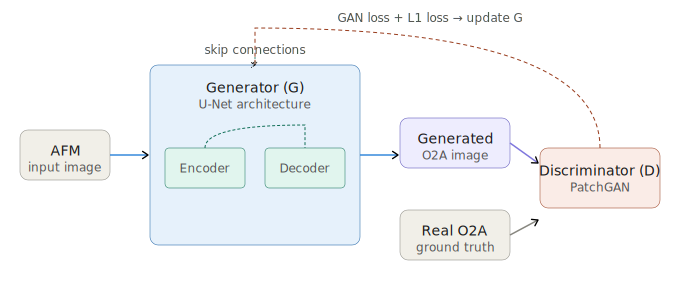
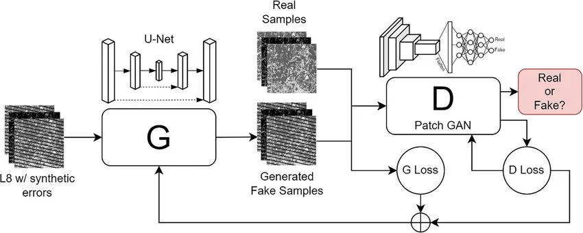
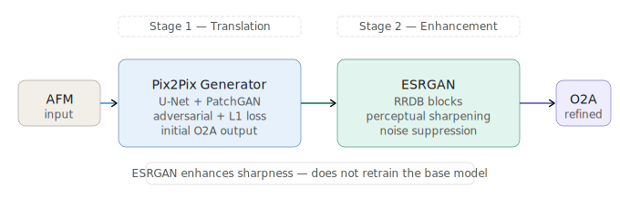
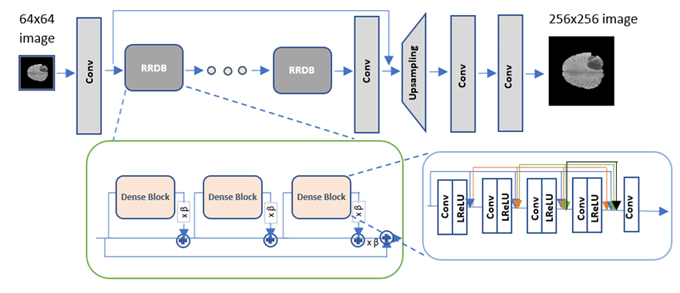
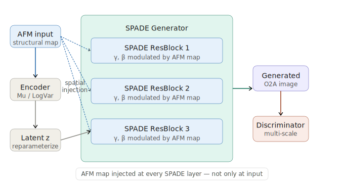
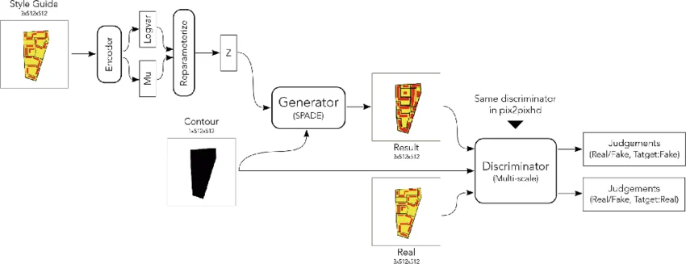
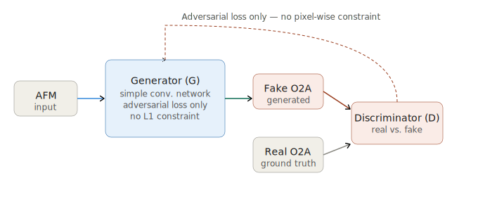
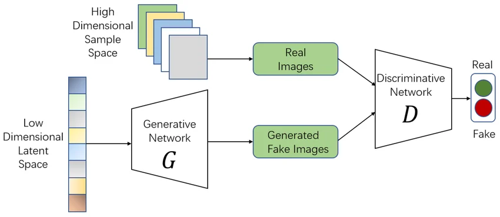
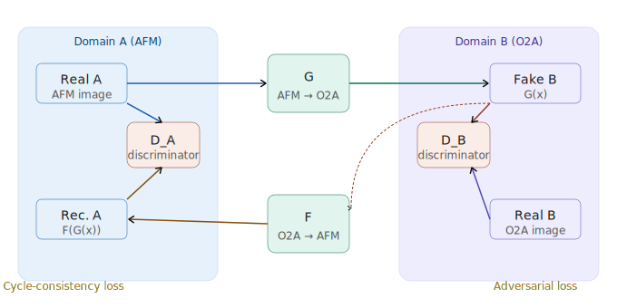
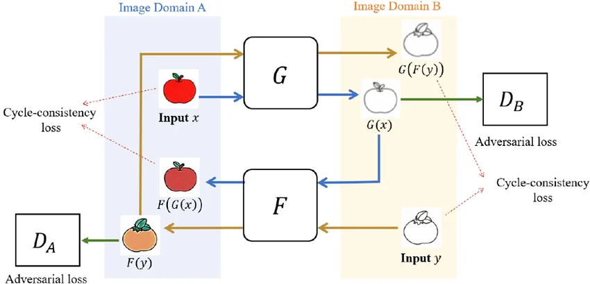

# 🔬 A Comparative Study of GAN-Based Image-to-Image Translation Methods for AFM-to-O2A Microscopy Images

**Tahir Kurtar** | Izmir Democracy University — Electrical and Electronics Engineering  
**Supervisor:** Asst. Prof. Başak Esin Köktürk Güzel  
**Year:** 2025

---

## 📌 Project Overview

This project investigates deep learning–based image-to-image translation methods for converting **Atomic Force Microscopy (AFM)** images into **Second Harmonic scattering-type Scanning Near-Field Optical Microscopy (O₂A)** amplitude maps.

s-SNOM systems required for O₂A imaging are expensive, complex, and not widely available. This study explores whether high-quality O₂A maps can be **synthetically generated from standard AFM images** using GAN-based models — reducing reliance on specialized optical instrumentation.

Five GAN architectures are implemented and systematically compared:

| Model | Type | Key Characteristic |
| --- | --- | --- |
| **Pix2Pix** | Supervised baseline | Paired image translation with L₁ + adversarial loss |
| **Pix2Pix + ESRGAN** | Supervised + enhancement | Super-resolution refinement on Pix2Pix outputs |
| **GauGAN** | Spatially-aware synthesis | Semantic and spatial conditioning via SPADE |
| **Vanilla GAN** | Minimal baseline | Adversarial loss only, no reconstruction constraint |
| **CycleGAN** | Unpaired translation | Cycle-consistency constraints, no paired data needed |

---

## 🧪 Dataset

The dataset consists of **paired AFM images and corresponding O₂A amplitude maps** acquired from the same nanoscale regions.

- **AFM images:** High-resolution surface topography of nanoscale material samples
- **O₂A maps:** Optical amplitude contrast obtained via s-SNOM measurements
- All image pairs are **spatially aligned** and normalized to the range **[−1, 1]**
- The dataset is split into **training, validation, and test sets**

> ⚠️ The raw dataset is not included in this repository due to data sharing restrictions.

---

## 🧠 GAN Models — Architecture & Methodology

---

### 1. Pix2Pix (Supervised Baseline)

**Architecture:**
- **Generator:** U-Net with encoder–decoder structure and skip connections
- **Discriminator:** PatchGAN — classifies local image patches as real or fake

**How it works:**
Pix2Pix is a conditional GAN trained on paired data. The generator learns to map AFM inputs to O₂A outputs by minimizing a combination of **adversarial loss** (fooling the discriminator) and **L₁ pixel-wise loss** (minimizing pixel-level reconstruction error).

**Why used in this project:**
Pix2Pix is the standard supervised baseline for paired image-to-image translation. It provides a strong reference point for evaluating all other models.

**Difference from others:**
Unlike CycleGAN, it requires paired training data. Unlike GauGAN, it does not incorporate spatial conditioning at multiple generator layers.

**Project-specific architecture diagram:**



**Reference architecture:**



---

### 2. Pix2Pix + ESRGAN (Enhancement Pipeline)

**Architecture:**
- **Stage 1:** Pix2Pix generates an initial O₂A prediction
- **Stage 2:** ESRGAN (Enhanced Super-Resolution GAN) refines the output using Residual-in-Residual Dense Blocks (RRDB)

**How it works:**
ESRGAN is applied as a post-processing step to the Pix2Pix output. It enhances perceptual sharpness and suppresses high-frequency noise by leveraging its super-resolution capabilities. The base Pix2Pix model is not retrained.

**Why used in this project:**
To investigate whether visual quality can be improved beyond standard Pix2Pix without retraining the base model.

**Difference from others:**
This is the only two-stage pipeline in the study. The first stage handles domain translation, the second handles visual refinement.

**Project-specific architecture diagram:**



**Reference architecture:**



---

### 3. GauGAN (Spatially-Aware Synthesis)

**Architecture:**
- **Encoder:** Encodes style information (Mu / LogVar) via VAE-style reparameterization
- **Generator:** SPADE (Spatially-Adaptive Denormalization) ResBlocks — AFM map injected at every layer
- **Discriminator:** Multi-scale discriminator (same as Pix2PixHD)

**How it works:**
GauGAN incorporates spatial and semantic information at **every generator layer** through SPADE normalization. Instead of encoding the input only at the bottleneck, it continuously injects the AFM structural map throughout generation via learned γ and β parameters — enabling fine-grained structural control at multiple scales.

**Why used in this project:**
To evaluate whether spatially-conditioned synthesis can better preserve the nanoscale structural details found in O₂A maps.

**Difference from others:**
GauGAN is the only model that uses spatially-adaptive normalization (SPADE). This allows it to maintain structural consistency across different spatial regions simultaneously — a critical property for nanoscale microscopy image synthesis.

**Project-specific architecture diagram:**



**Reference architecture:**



---

### 4. Vanilla GAN (Minimal Baseline)

**Architecture:**
- **Generator:** Simple convolutional network
- **Discriminator:** Standard convolutional classifier

**How it works:**
Trained solely with adversarial loss. The generator learns to produce images that fool the discriminator, without any explicit reconstruction constraint. There is no L₁ loss guiding pixel-level accuracy.

**Why used in this project:**
To serve as a minimal reference and highlight the benefits of more structured architectures such as Pix2Pix and GauGAN.

**Difference from others:**
The simplest model in the comparison. The absence of pixel-wise loss means the model is not explicitly guided to match the ground truth — it only learns to produce realistic-looking images.

**Project-specific architecture diagram:**



**Reference architecture:**



---

### 5. CycleGAN (Unpaired Translation)

**Architecture:**
- **Two generators:** G (AFM → O₂A) and F (O₂A → AFM)
- **Two discriminators:** D_A and D_B
- **Cycle-consistency loss:** enforces F(G(x)) ≈ x and G(F(y)) ≈ y

**How it works:**
CycleGAN learns bidirectional mappings between two domains without requiring paired training data. The cycle-consistency constraint ensures that translating an image to the other domain and back produces the original image — providing a form of implicit supervision without pixel-wise pairing.

**Why used in this project:**
To assess the impact of removing strict pixel-level supervision. Even though paired data is available, CycleGAN is evaluated to benchmark the unpaired setting against supervised models.

**Difference from others:**
The only model that does **not** use paired data during training. This makes it more flexible but less precise — it cannot enforce pixel-wise correspondence between AFM and O₂A domains.

**Project-specific architecture diagram:**



**Reference architecture:**



---

## 📊 Results

### Quantitative Evaluation

| Model | L₁ Loss ↓ | SSIM ↑ | PSNR ↑ |
| --- | --- | --- | --- |
| **Pix2Pix** | 0.2084 | 0.4422 | 19.48 dB |
| **Pix2Pix + ESRGAN** | 0.2062 | 0.4419 | 19.39 dB |
| **GauGAN** | **0.202** | **0.457** | **19.49 dB** |
| **Vanilla GAN** | 0.2054 | 0.4255 | 19.22 dB |
| **CycleGAN A→B** | 1.8326 | 0.2421 | 12.86 dB |
| **CycleGAN B→A** | 1.8326 | 0.2216 | 11.04 dB |

**GauGAN achieves the best overall quantitative performance** — lowest L₁ loss, highest SSIM and PSNR.

### Qualitative Evaluation

- **GauGAN** produces the sharpest and most spatially coherent O₂A images with improved edge definition
- **Pix2Pix** and **Vanilla GAN** exhibit comparable visual quality; Vanilla GAN occasionally yields sharper results
- **Pix2Pix + ESRGAN** improves visual smoothness but does not enhance structural fidelity
- **CycleGAN** captures coarse structures but introduces smoothing artifacts and lacks pixel-level correspondence

### Key Finding

> Numerical metrics alone do not fully capture model quality in microscopy image synthesis. GauGAN's advantage in spatial coherence is more apparent in visual inspection than in quantitative scores — highlighting the importance of combining both evaluation approaches.

---

## 📈 Evaluation Metrics

**L₁ Loss (Mean Absolute Error):** Measures pixel-wise reconstruction accuracy between generated and real O₂A images.

**SSIM (Structural Similarity Index):** Measures perceptual similarity by comparing luminance, contrast, and structural information.

```
SSIM(x, y) = (2μxμy + C1)(2σxy + C2) / (μx² + μy² + C1)(σx² + σy² + C2)
```

**PSNR (Peak Signal-to-Noise Ratio):** Measures signal fidelity in decibels. Higher values indicate less distortion.

```
PSNR = 10 × log10(255² / MSE)
```

---

## 🗂️ Repository Structure

```
📁 AFM-to-O2A-GAN-Comparison
├── 📁 notebooks
│   ├── pix2pix.ipynb
│   ├── pix2pix_esrgan.ipynb
│   ├── gaugan.ipynb
│   ├── vanilla_gan.ipynb
│   └── cyclegan.ipynb
├── 📁 cyclegan
│   ├── cyclegan_train.py
│   └── 📁 test_outputs
│       ├── example_1_A2B.png
│       ├── example_1_B2A.png
│       ├── example_2_A2B.png
│       └── ...
├── 📁 images
│   ├── 📁 diagrams
│   │   ├── pix2pix_architecture.svg
│   │   ├── cyclegan_architecture.svg
│   │   ├── gaugan_architecture.svg
│   │   ├── esrgan_pipeline.svg
│   │   └── vanilla_gan_architecture.svg
│   └── 📁 references
│       ├── pix2pix_reference.png
│       ├── cyclegan_reference.png
│       ├── gaugan_reference.webp
│       ├── esrgan_reference.png
│       └── vanilla_gan_reference.png
├── 📁 poster
│   └── poster.pdf
├── 📁 report
│   └── report.pdf
└── README.md
```

> ⚠️ CycleGAN model checkpoints (~340 MB per file, 20 epochs) are not included in this repository due to GitHub file size limits. All checkpoints are available on Hugging Face: [Download Checkpoints](https://huggingface.co/TahirKurtar/cyclegan-afm-to-o2a)

---

## 🛠️ Implementation Details

| Detail | Description |
| --- | --- |
| **Framework** | PyTorch |
| **Optimizer** | Adam (fixed learning rate and momentum) |
| **Training** | Fixed epochs with early stopping on validation loss |
| **Hardware** | GPU-enabled (Kaggle / local) |
| **Pix2Pix, ESRGAN, GauGAN, Vanilla GAN** | Implemented and trained on Kaggle |
| **CycleGAN** | Implemented and trained locally (VS Code) |

---

## 📚 References & Visual Sources

1. Zhang et al. Pix2PixHD++: Image-to-Image Translation via Enhanced Generator and Discriminator. arXiv:2504.02982, 2024.
2. He et al. An Introduction to Image Synthesis with Generative Adversarial Nets. arXiv:1803.04469, 2018.
3. Isola et al. Image-to-Image Translation with Conditional Adversarial Networks. arXiv:1611.07004, 2017.
4. Bagherkhani et al. Antenna Near-Field Reconstruction from Far-Field Data Using CNNs. arXiv:2504.17065, 2025.
5. Chen & Dal Negro. Physics-informed Neural Networks for Imaging and Parameter Retrieval. arXiv:2109.12754, 2021.
6. Stanciu et al. Inferring s-SNOM Data from Atomic Force Microscopy Images. arXiv:2504.02982, 2025.
7. **Pix2Pix Schema:** [View Source](https://www.researchgate.net/publication/383558465/figure/fig3/AS:11431281274620774@1725036289021/Schema-of-Pix2Pix-GAN-architecture.jpg)
8. **ESRGAN Structure:** [View Source](https://encrypted-tbn0.gstatic.com/images?q=tbn:ANd9GcTgirWSTo26Ghkm4ito21-_2_YIaR4OH8FMIw&s)
9. **GauGAN Detail:** [View Source](https://www.researchgate.net/publication/348871964/figure/fig5/AS:1003598439792648@1616287922703/Detail-of-GauGAN-architecture.png)
10. **Vanilla GAN Flow:** [View Source](https://www.researchgate.net/publication/340458845/figure/fig1/AS:11431281379521923@1744760355523/The-architecture-of-vanilla-GANs.tif)
11. **CycleGAN Diagram:** [View Source](https://www.researchgate.net/publication/340691571/figure/fig1/AS:11431281179193248@1691160252565/Network-architecture-and-data-flow-chart-of-CycleGAN-for-image-to-image-translation.png)

> **Note:** Click the links above to view the original high-resolution reference diagrams.